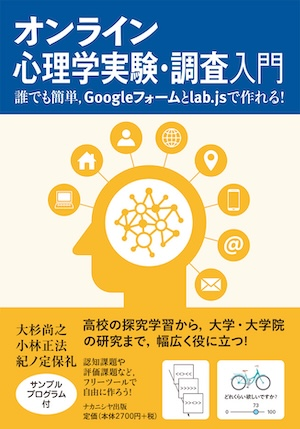

## このサイトについて
<a href = "https://www.nakanishiya.co.jp/book/b10146240.html" arget="_blank" rel="noopener noreferrer">「オンライン心理学実験・調査入門：誰でも簡単,Googleフォームとlab.jsで作れる!」</a>で章ごとに紹介したlab.jsプログラムのソースファイルとデモ（パソコン用），正誤情報，便利ツールなどを提供しています。ソースファイル（JSON形式）はクリックするとダウンロードできます。ソースファイルは<a href = "https://lab.js.org/" target="_blank" rel="noopener noreferrer">lab.js Builder</a>で読み込むことができます。

### 書籍情報

### 注意事項
このサイト上で実施していただいたデモのデータは，デモ実施後に保存していただけます。ただし，デモを用いた実験・調査はご遠慮ください。なお，実施していただいたデータがサイト作成者に伝わることや（ご自身で保存された場合以外）保存されることはありません。

## 第1章
### 指示忘却課題（リスト法）
 * <a href="ch1/demo/" target="_blank" rel="noopener noreferrer">デモ</a>
 * <a href="ch1/2-LMDF-demo.json" download>ソースファイル</a>

## 第3章
### デモデータ（demodata.xlsx)
 * <a href="ch3/demodata.xlsx" download>デモデータ</a>

## 第4章
### Hello world!
 * <a href="ch4/demo1/" target="_blank" rel="noopener noreferrer">デモ</a>
 * <a href="ch4/4-hello-world-demo.json" download>ソースファイル</a>
 
### 図形表示（Screen canvas）
 * <a href="ch4/demo2/" target="_blank" rel="noopener noreferrer">デモ</a>
 * <a href="ch4/4-screen-canvas-demo.json" download>ソースファイル</a>
 
## 第5章
### 心理学調査1（簡易アンケート）
 * <a href="ch5/demo1/" target="_blank" rel="noopener noreferrer">デモ</a>
 * <a href="ch5/5-survey1-demo.json" download>ソースファイル</a>

### 心理学調査2 （日本語版TCAQ）
 * <a href="ch5/demo2/" target="_blank" rel="noopener noreferrer">デモ</a>
 * <a href="ch5/5-survey2-demo.json" download>ソースファイル</a>

### 心理学調査2 Scripts版（日本語版TCAQ）
Scripts版は書籍では詳しく取り上げていないため，詳細は<a href ="https://labjs.thesimple.ink/scripts%E3%81%A7%E8%B3%AA%E5%95%8F%E7%B4%99%E8%AA%BF%E6%9F%BB%E3%82%92%E4%BD%9C%E3%82%8B-034ebe6c36a3448e836dde7afc2e4012" target="_blank" rel="noopener noreferrer">解説（別サイト）</a>をご覧ください。
 * <a href="ch5/demo3/" target="_blank" rel="noopener noreferrer">デモ</a>
 * <a href="ch5/5-survey2-scripts-demo.json" download>ソースファイル</a>

## 第6章
### フランカー課題
 * <a href="ch6/demo/" target="_blank" rel="noopener noreferrer">デモ</a>
 * <a href="ch6/6-flanker-task-demo.json" download>ソースファイル</a>

## 第7章
### ストループ課題
 * <a href="ch7/demo1/" target="_blank" rel="noopener noreferrer">デモ</a>
 * <a href="ch7/7-stroop-task-demo.json" download>ソースファイル</a>

### サイモン課題
 * <a href="ch7/demo2/" target="_blank" rel="noopener noreferrer">デモ</a>
 * <a href="ch7/7-simon-task-demo.json" download>ソースファイル</a> 

## 第8章

### 刺激画像(大きさ：400pixel × 250pixel)
* <a href="ch8/img/1.jpg" download>りんご(1.jpg)</a>
* <a href="ch8/img/2.jpg" download>みかん(2.jpg)</a>
* <a href="ch8/img/3.jpg" download>いちご(3.jpg)</a>
* <a href="ch8/img/4.jpg" download>キウイ(4.jpg)</a>

### 評価課題（Canvas Screen）（キーボード）
 * <a href="ch8/demo1/" target="_blank" rel="noopener noreferrer">デモ</a>
 * <a href="ch8/8-rating-task-canvas-key-demo.json" download>ソースファイル</a>
 * <a href="ch8/8-rating-task-canvas-key-static-demo.json" download>Static版ソースファイル</a>

### 評価課題（Canvas Screen）（AOI）
 * <a href="ch8/demo2/" target="_blank" rel="noopener noreferrer">デモ</a>
 * <a href="ch8/8-rating-task-canvas-aoi-demo.json" download>ソースファイル</a> 
 * <a href="ch8/8-rating-task-canvas-aoi-static-demo.json" download>Static版ソースファイル</a>

## 第9章
### 評価課題（Page HTML）
 * <a href="ch9/demo1/" target="_blank" rel="noopener noreferrer">デモ</a>
 * <a href="ch9/9-rating-task-page-html-demo.json" download>ソースファイル</a>
 * <a href="ch9/9-rating-task-page-html-static-demo.json" download>Static版ソースファイル</a>

### 評価課題（Page HTML）（スライダー）
 * <a href="ch9/demo2/" target="_blank" rel="noopener noreferrer">デモ</a>
 * <a href="ch9/9-rating-task-page-html-slider-demo.json" download>ソースファイル</a> 
 * <a href="ch9/9-rating-task-page-html-slider-static-demo.json" download>Static版ソースファイル</a>

## 第10章
### 再認記憶課題
 * <a href="ch10/demo/" target="_blank" rel="noopener noreferrer">デモ</a>
 * <a href="ch10/10-old-new-recognition-task.json" download>ソースファイル</a>

## 第12章
### デモデータ（12-demo-data.csv)
 * <a href="ch12/data/12-demo-data.csv" download>デモデータ</a>

## 第13章
### フランカー課題
 * <a href="ch13/demo1/" target="_blank" rel="noopener noreferrer">デモ</a>
 * <a href="ch13/13-flanker-task-scripts-demo.json" download>ソースファイル</a>

### 再認記憶課題
 * <a href="ch13/demo2/" target="_blank" rel="noopener noreferrer">デモ</a>
 * <a href="ch13/13-old-new-recognition-task-demo.json" download>ソースファイル</a>

## 便利ツール
書籍では詳しく紹介していませんが，lab.jsと合わせて使うと便利なツールをいくつか作成しました。

### [addBOM：csvへのBOM付与](tool/addBOM.html)
lab.jsで出力されるcsvにはBOMがついていないため，Excelなどで読み込むと文字化けします。このツールでcsvにBOMを付与してから読み込むと文字化けしません。変換したファイルをZIPでダウンロードします。複数ファイルを選択可能です。

### [json2csv：JSONをcsvに変換](tool/json2csv.html)
JATOSで実施した場合に出力されるJSONをcsvに変換するツールです。metaなどのネストしている部分も展開できます。

## 正誤表

|ページ|誤|正|
|----|----|----|
| 19　図1-4 | (b)DQSの例  | (b)DQSの例　※質問項目は尾崎他（2016）短縮版セルフコントロール尺度より引用 |
| 21　引用文献 | 尾崎由佳・後藤崇志・小林麻衣・沓澤岳 (2016). セルフコントロール尺度短縮版の邦訳および信頼性・妥当性の検討. 心理学研究, 87(2), 144-154. |
| 73 | 収集されたデータが個人が特定できるデータが公表されることは決してありません。| 収集されたデータについては，個人が特定できる形で公表されることは決してありません。|
| 120 | 8-1-1. 調査の構成 | 8-1-1. 課題の構成 |
| 144 | 作成したクラスを指定します。最初の タグに「class = "justify"」を入力してください。| 作成したクラスを指定します。最初の
 タグに「class = "justify"」を入力してください。 |
## その他・便利な情報など

### <a href = "https://labjs.yucis.net/" target="_blank" rel="noopener noreferrer">lab.js授業用ページ</a>
lab.jsに関する解説を記載しています。